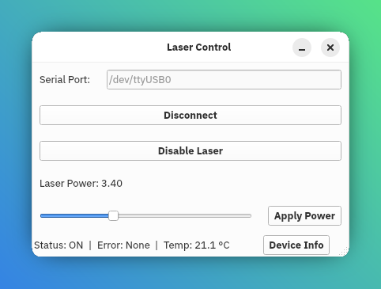

# lambda_mini

A Python package and GUI tool for controlling and monitoring a [RGB-lasersystems lambda mini](https://rgb-lasersystems.com/products/) over a serial connection.  
It provides functions for querying device information, status, errors, power, and temperature, along with a PyQt-based interface for interactive use.



## Features

- Query device information (`laser_get_device_info`)
- Monitor system status (`laser_get_status`)
- Read temperature values (`laser_get_temperature`)
- Retrieve error codes and descriptions (`laser_get_error`)
- Initialize and manage a new connection (`laser_new`, `laser_init`)
- Enable or disable the laser (`laser_enable`, `laser_disable`)
- Inspect and control laser power:
  - Get maximum power (`laser_get_max_power`)
  - Read current power settings (`laser_power_info`)
  - Set power level (`laser_set_power`)
- Data classes for structured information:
  - `LaserDeviceInfo`
  - `LaserStatus`
  - `LaserTemperature`
  - `LaserPower`
  - `LaserError`

## Installation

Clone and install directly from GitHub:

```bash
pip install git+https://github.com/Peter-Barrow/lambda-mini-laser.git
````

## Usage

### As a library

You can import the package and use its functions directly:

```python
from lambda_mini import laser_new, laser_get_device_info

conn = laser_new("COM3")  # or "/dev/ttyUSB0" on Linux
info = laser_get_device_info(conn)
print(info)
```

### As a GUI

To launch the graphical interface:

```bash
python -m lambda_mini.lambda_mini
```
Alternatively it will be available on `$PATH` as
```bash
lambda-mini-gui
```

This will open a window where you can connect to the laser, enable/disable it, adjust power, and view device status.

## Requirements

* Python 3.9+
* [PyQt6](https://pypi.org/project/PyQt6/)
* [pyserial](https://pypi.org/project/pyserial/)

```

```
